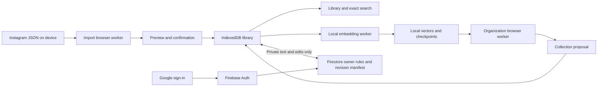

# Architecture

## Runtime and boundaries

A static React application served by Vercel Hobby. Browser IndexedDB is the offline cache and authority for device-only libraries. Optional Firebase Spark is the cloud authority for signed-in libraries: Firestore rules enforce owner-only paths and a manifest transaction enforces compare-and-swap revisions. Vercel Hobby is permitted only for personal, non-commercial use under its current terms; public activation is blocked unless that remains true. No paid runtime, Cloud Functions, D1, R2, Vectorize, Better Auth, Resend, OpenAI, or cloud queue is required.

## Data model

Types and Zod validators in src/lib/model.ts describe Item, Collection, Library, ImportRecord, Intent. An item holds canonical shortcode/URL, independent fbid, distinct captions, creator, hashtags, unknown-semantics export timestamp, import date, favorite/archive/note/tags/intent, memberships, and explicit exclusions. Collections have stable ID, name, parent, manual-override marker, deterministic style. Libraries include source items, collections, removal tombstones, suppressed automatic collection IDs, bounded import history, and local revision.

Cloud persistence uses a small owner-only manifest plus immutable, bounded Firestore snapshot chunks. The client stages chunks, atomically advances the manifest only when its expected revision matches, and then best-effort removes the prior snapshot. This avoids Firestore's per-document size limit without silently overwriting another device. Firestore rules, not browser checks, are the authority for owner isolation and the closed release gate.

IndexedDB stores owner-keyed snapshots, up to ten prior local versions, owner/item/source-hash vectors, and separate owner-keyed proposal drafts. Model assets use the browser HTTP/Cache API mechanisms from Transformers.js. No original uploaded files or image assets are retained.

## Import and invariants

The browser worker accepts a bounded JSON string, parses the observed label_values format, validates post links, normalizes supported fields, reports row-specific invalid entries, and computes a SHA-256 digest. The UI previews before committing. Local transaction validates the resulting library, appends import metadata, and checkpoints history. Duplicate source identities coalesce caption variants within an upload; reimports update source fields while retaining all personal state. Items absent from an export remain. Tombstones suppress surprise restoration. The 5,000 count includes archive.

Local allowance is 5,000 saves and 15 MiB normalized item text. Cloud snapshots are chunked so a valid bounded library does not depend on one Firestore document's size limit. Items and collection identities must be unique; nesting is at most one level; memberships must resolve to collections; URLs are restricted to original Instagram p/reel/tv posts.

## Organization and search

Pinned model: Xenova/multilingual-e5-small commit 761b726dd34fb83930e26aab4e9ac3899aa1fa78; upstream intfloat multilingual-e5-small MIT. Quantized ONNX model 118,308,185 bytes plus tokenizer/runtime; preserve license notices. Transformers.js feature-extraction uses mean pooling, normalization, and E5 query:/passage: prefixes. WASM is used consistently initially; WebGPU is not advertised as verified. No private text goes to model hosting servers. Model loading has no private URL-derived fetches.

Completed vectors are cached per owner/item and SHA-256(model revision + source captions/hashtags + note/tags). Failed results are not cached as successful empties. Closing/canceling terminates inference, preserves completed vectors, and rejects pending calls. Re-running checks caches and resumes. There is no server lease or autonomous progress while closed.

Automatic proposals start with supported topic candidates, merge humor synonyms, and keep Study, Productivity, and AI Tools separate. Repeated meaningful personal tags can surface other interests. Caption/hashtag/personal evidence anchors at least five saves per suggestion; the cached model may conservatively expand a supported group if its text does not contradict another anchored topic. The text-only fallback uses direct evidence. Generic and promotional names are rejected, redundant groups merged, and at most three automatic memberships are proposed. Sparse saves stay Unsorted. These defaults need private owner-reviewed precision and coverage evaluation before quality claims. Manual subcollections and intent remain available.

Suggestion publication preserves all manually edited collections and memberships and obeys explicit exclusions. The proposal UI adds only selected, individually reviewed groups and preserves existing groups and memberships; children require a selected reviewed parent. Current semantic graph produces one primary membership, while source-word mode supports overlapping memberships. Manual membership remains unlimited. No LLM prompts, inference tools, or structured generative outputs exist in the zero-budget architecture; imported instructions cannot control a model tool agent.

MiniSearch indexes captions/hashtags/notes/tags, creators, URLs, and collection names. Related search combines lexical and local vector top-50 rankings through reciprocal-rank fusion, thresholding semantic matches at 0.72. Filters are applied to authorized local items. Cached vectors with changed hashes are ignored. Query text and vectors are never sent to a provider. Search runs after library loading; pagination of initial cloud snapshots is unnecessary at the bounded 15 MiB size, but update traffic is incremental. A new device rebuilds its private index.

## Public interfaces

Browser import worker request: raw JSON string; response {preview:{items,issues,duplicates,total,digest}} or {error}. Inference worker request {id,text}; response {id,vector} or safe error; download events {type:'download',loaded,total}. Organization worker request {items,vectors?}; response {groups} or safe error.

Firebase cloud interface:

- Google sign-in is handled by Firebase Authentication. Firestore paths are scoped below `/users/{uid}` and rules compare that uid with the authenticated caller.
- A manifest holds `{revision,snapshotId}`. A client stages bounded snapshot chunks, then a Firestore transaction advances the manifest only when the expected revision matches. Wrong revisions raise `REVISION_CONFLICT`.
- New manifest and snapshot creation requires the operator-owned `/config/release` document to have `accepting=true`; it is false by default. Existing user data remains readable, writable, and deletable when admissions close.
- Account deletion deletes every known snapshot and the manifest, then deletes the active Firebase Authentication account. Recent login may be required by Firebase.

Application routes: /, /organize, /saves, /search, /collection/:id, /save/:id, /settings, /help, /privacy, /terms, /auth/callback, 404. Query filters are URL-addressable. Stable item IDs survive reimport and export.

## Synchronization and failures

Local changes save before network writes, remain visibly pending on failure, and can be exported. One local mutation lock avoids concurrent writes from this mounted app. Cloud revision checks prevent another device/tab from silently overwriting. Reload reads the remote baseline but preserves dirty local snapshots. Explicit conflict resolution offers local replacement or remote replacement; advise exporting first. No last-writer-wins surprise. Sign-out rejects unresolved pending state. A generation check discards stale owner-load responses.

Preview/file parsing, model download/inference, organization, storage exhaustion, auth, sync conflict, cloud capacity, and account deletion each have recoverable plain-language outcomes. Schema/network failures never manufacture classification or deleted-post states. Storage quota failure must not claim data saved. Original-source viewing remains available when smarter search fails.

## Security, privacy, and retention

Firestore owner rules deny unauthenticated callers and prevent a user from reading or changing another user's documents. Firebase web configuration is public identity data; no service-account credential exists in the browser. Google sign-in permits exact authorized domains. JSX renders source as text; no dangerouslySetInnerHTML. Only validated HTTPS Instagram external links, noopener/noreferrer, no arbitrary scraping. Static CSP, frame denial, restrictive permissions, safe referrer policy. No private query/caption logs, analytics, replay, or provider LLM calls.

Raw upload stays in memory only. Normalized data persists until deletion; local history ten versions, local vectors bounded by saved identities. Model cache is public, not user content. Export contains full source and edits, not auth secrets. Sign-out removes the current account's private local stores. Account deletion removes the active account's Firestore snapshots before its Firebase Authentication record. Other offline devices can retain cached content; their removal is not remotely guaranteed. Manual recovery exports are encrypted on operator storage and expire within 30 days.

## Deployment and cost

Use a free Vercel Hobby subdomain only while the deployment remains personal and non-commercial, plus Firebase Spark with no payment-enabled upgrade. Cloud activation is disabled by default. Firestore's exact current Spark quotas are a release gate; close admissions before headroom is exhausted. These are operational controls, not automated guarantees against provider policy changes. No synthetic traffic to evade provider limits. CI checks/build/browser tests; output dist. Separate development and public project configurations. Protected backups, restore rehearsal, deployed-rule review, and live integration verification are required before activation. See OPERATIONS.md.

The runtime uses Transformers.js 4 and local standard WASM assets (about 14 MB). Unused asyncify WASM is excluded from the build to keep the static artifact lean; production browser tests verify this path under the deployed CSP. Model input is truncated to its tokenizer context window; exact search retains the full captions. Language filters use franc-min estimates on longer captions, with unknown retained for insufficient evidence.

On-demand Reel display uses a sandboxed Instagram iframe from a canonical Reel URL. CSP frame-src permits only https://www.instagram.com. No Meta script executes in the parent application and no Instagram media is fetched or retained by Crate. Card previews lazy-load Instagram embeds while browsing; their inert frames are covered by a modal-opening button. Preview dialogs mount only on explicit user activation and unmount on close; privacy copy discloses the third-party request and cookies. Creator website links retain validated HTTP(S) source URLs without credentials.
